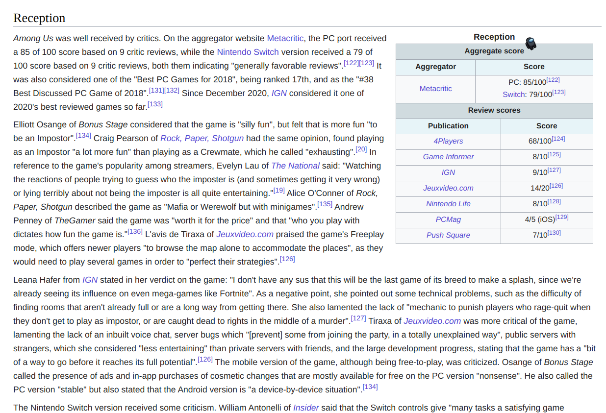
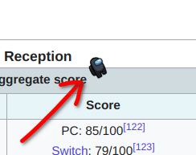

# Suspicious Search

Suspicious Search is a simple exercise to practice with events in JavaScript.
The goal of the game is to find astronauts of various colors hidden between text on a Wikipedia page.
Clicking on them will increase your score and reset a timer that will continuously count up while searching.

Here it is

